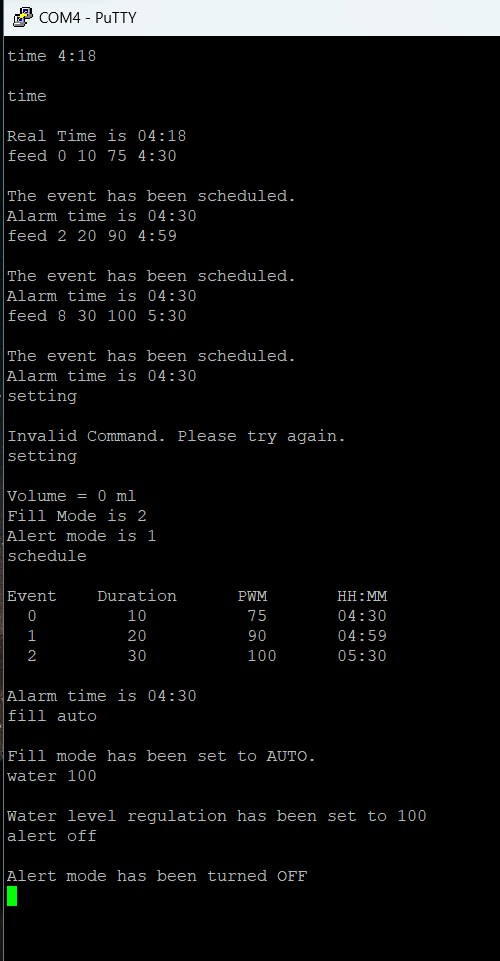

# Automated-Pet-Feeder

This project implements an automated pet feeder using the TM123GH6PM Tiva board. The system dispenses pet food at scheduled times and water based on owner's settings.

 <b> Circuit used for capacitative bowl. </b> 

## Features

- **Scheduled Feeding:** Set up specific feeding times for your pet.
- **Water Regulation Option:** Dispense water based on low water or motion detection.
- **Alert Mode Option:** Alert the owner if the water source is low. 

## Hardware Components
  |                         |
  | ------------------------|
  | TM123GH6PM Tiva Board   |
  |  Passive IR Sensor      |
  | Speaker                 |
  | 12V Motors connected to MOSFETS (x2)|
  | Diodes                       |
  | Capacitative Water Sensing circuit   |

### Circuit Diagrams

 <b> Circuit used for the Auger and Water Dispenser. </b> 

 

 <b> Circuit used for capacitative bowl. </b> 

 

 <b> Circuit used for speaker. </b> 

 
## Peripherals Used
  |                         |
  | ------------------------|
  | GPIO   |
  |  UART  |
  | HIB    |
  | EEPROM |
  |  Timers |
  |   PWM  |
  | Analog Comparator |

## Software Features
- `time HH:MM`: This command lets the user set the time for the pet feeder.
- `time`: Displays the current time.
- `feed x y z a b`: Adds a feeding schedule. Command contains 5 parameters - *index*, *Motor duration*, *Motor Speed*, *Hours* and *Minutes*.
- `feed x delete`: Lets the user delete a feeding schedule by specifying the index of the schedule.
- `schedule`: Displays the entire stored feeding schedule.
- `water x`: Sets the water level regulation by specifying the amount of volume. If water level goes below the level, water is dispensed if FILL mode is selected.
- `fill y`: Lets the user to choose between AUTO water filling or MOTION detected water filling.
- `alert ON|OFF`: If alert mode is ON, the user is alarmed when there is low water.
- `setting`: Displays the configuration settings - Water Level, Fill Mode and Alert Mode.

## Interface

User can use a serial interface (Putty) to input feeding schedules and change other settings

